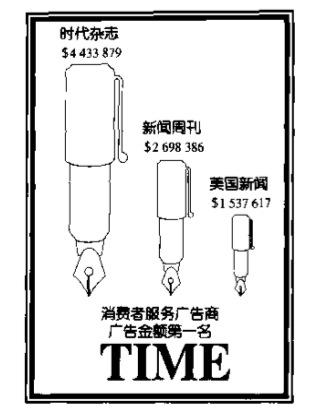
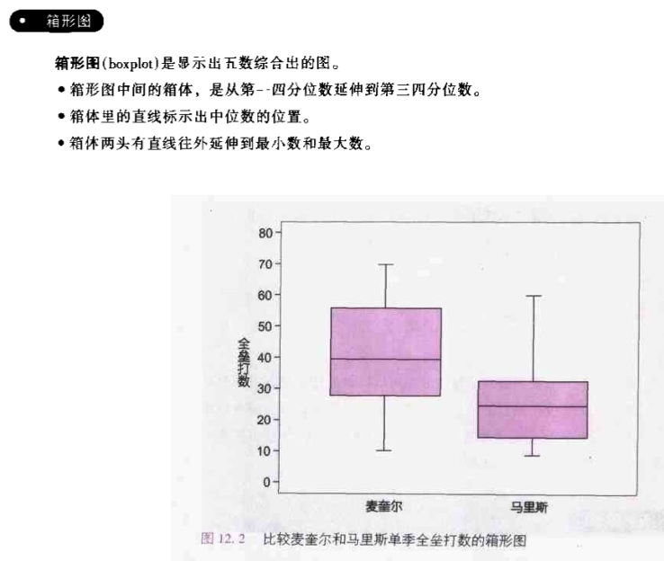
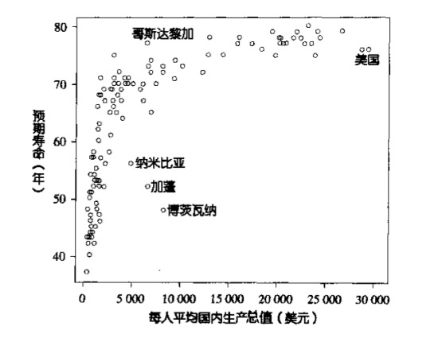
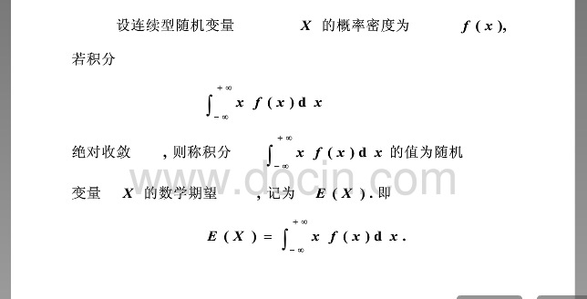

###chapter3 样本告诉我们什么   
* 当抽样总体数量过大，而单次抽样数量较小，采取取多次抽计算概率样的方式，概率值的分布会呈正态分布，出现次数最多的概率值最接近真实的概率值。且概率值的分布随着抽样样本的扩大而从离散变得紧凑，如果用总体数量作为抽样，那概率值永远都是真实的那个概率值。   

###chapter4 真实世界中的抽样
* 如果某个区域参与抽样调查的无回应用户较多，那么适当对本地区有回应用户的调查结果进行加权可以矫正调查的偏差来源。
* 加权的目标是使得统计结果从年龄，性别，地理位置等方面看起来尽量分布均匀。      

###chapter5 实验面面观
* __实验变量__是用来指度量结果的变量，__解释变量__是指造成应变量变化的变量，__处理__是任何加诸于受试对象的特定实验条件
* __双盲实验__是指不论是受试对象，还是和受试对象有互动的人，都不知道哪位受试对象接受了哪种处理。

###chapter10 好的图及坏的图
* 数据分为__numerical data__(可测量数据)和__category data__(不可测量数据)，二者大都可以互相转换
* 象形图（pictogram）能起到放大差距的作用,如下图:   
   

###chapter12 用数字描述分布
* 最小最大值提供了分布尾部的信息，__median__(中位数)和__quartile__(四分位)数提供了分布中心和离度的信息，把这5个数字综合起来描述分布的情况，叫__five-number summary__(五数综合)，根据five-number summary绘制的图形叫__boxplot__(箱形图)。
   

* 除了五数综合，更为常用的是__mean__(平均数)和__standard deviation__(标准差)。标准差度量的是观测值和平均数之间的平均距离，也就是观测值的分散程度。标准差的平方叫__variance__(方差)。显然，如果标准差为0，说明所有观测值都为同一个值。
* 平均数（mean）和中位数（median）的主要区别是：极端值对平均数的影响远大于对中位数的影响。很多和钱有关的分布（收入，财富，房价）都具有很强的右偏现象（80%的财富掌握在20%人的手里），所以描述这类分布通常选择中位数而不是平均数，所以拿人均GDP或者人均收入说事的都是在耍流氓。
* 关于投资，投资者最好了解一项投资的年获利分布，包括获利形态的中心和离度。金融专家通常用平均数和标准差来描述投资的获利状况，可以预见，平均获利和标准差是正比的关系，通俗讲就是风险越大，利润越高。
* 平均数和标准差会受异常值的长尾巴影响，相比之下，五数综合受影响的程度小很多。所以要描述含有异常值的分布（偏斜分布），用五数综合好于平均数 + 标准差，只有在分布大致对称（如正态分布）且没有异常值的时候，平均数+标准差才会比较合适。

###chapter13 正态分布
* 高斯首先把正态曲线应用到数据误差的描述上，所以正态分布又叫高斯分布。19世纪时，正态曲线还叫误差曲线，当多次测量某个值的时候，测量值总是在实际值两边波动，正好符合正态分布。
* __density curve__(密度曲线)的__equal-areas point__(等面积点)是中位数；平衡点（如果用实心材料做成，会在此点平衡）是平均数。
* __normal denisty curve__正态密度曲线有一个有趣的特点，就是在两边曲线上，曲率发生改变的点，距离峰值点刚好是一个标准差的距离。峰值是平均点的位置，所以一旦知道平均值和标准差，一特定的个正态曲线就确定了。
* 正态分布一些有趣的数字：68%的观测值落在距离平均数1个标准差的范围内，95%的落在2个标准在的范围内，99.7%的落在3个标准差的范围内。所以，给你一个正态曲线，你可以目测很多数据，比如平均数，比如标准差，比如数据分布范围等等，看起来很高大上的。
* 标准差是正态分布里最自然的度量单位，所以我们可以把某个测量值偏离平均数的范围以标准差为基本单位来描述，具体方法为比如某个分布的平均数为10，那么我们可以说20距离平均数1个标准差，5距离平均数-0.5个标准差。这种表达方式叫__standard score__(标准计分)，公式化描述: 标准计分 ＝（观测值 - 平均数） / 标准差

###chapter14 散布图和相关系数
* 如果想观察两个变量之间是否存在某种关系，那就画张__scatter plot__(散布图)吧。这很像编程中依靠暴力打表然后肉眼寻找数据之间的规律。   

* __correlation__(相关系数)描述两个__quantitative variable__(数量变量)之间直线相关的方向和强度，通常用r来表示。假设我们有一组点的分布坐标数据，计算这组数据r值的过程：为分别求出x和y的平均数A和标准差S，然后计算每一个点的x和y的标准计分，最后求每个点的x和y的标准计分乘积的平均值，就是r。公式化描述为：r = sum((x - Ax) / Sx * (y - Ay) / Sy) / (n - 1)   
* r具有以下性质：1、正的r表示正相关，负的r表示负相关 2、r永远在-1和1之间 3、r只是两个变量之间直线相关性的强度

###chapter15 描述相关关系：回归，预测及因果关系
* __regression line__(回归直线)用来预测对一个给定的x，其相应的y会是多少
* 对于一组观测数据，我们想要的理想回归曲线满足预测值和观测值的差距尽量小，也就是同一个x下，观测点相应的y值和回归直线对应的y值差别尽量小。有许多方法来求这样一条直线，用的最多的是[__least-squares method__](http://zh.wikipedia.org/wiki/最小二乘法)(最小二乘法)
* 两个变量存在相关关系并不等于一个变量变化，另一个变量也跟着变化
* 最小二乘法回归与相关性系数r密切相关，明确一点说，r^2告诉我们，反应变量y的变异中，有多少比例可以用y和x的直线相关来解。   

###chapter16 消费者物价指数和政府统计
* 将时间A的某美元数目转换成时间B同样购买力的美元数目：$B = $A * CPI(B) / CPI(A)

###chapter20 赌场的优势：期望值
* __expected value__(期望)，假如离散型随机变量X的分布率P(x=xi)= pi,若级数sum(xi * Pi) 1<i<+oo绝对收敛，则称其为随机变量X的数学期望。它从本质上体现了随机变量可能取值的真正平均值，绝对收敛性保证了级数的和不随着各项次序的改变而改变。因为期望反应的是X的平均值，它不应该可能值的排列顺序改变而改变。期望的应用场景包括帮助你做最佳的决策，比如面对储蓄和投资如何抉择，只需要计算一下二者的期望收入。它还能帮你判断一个射手的技术优劣，只需看他的期望表现即可。还有很多其他场景，期望是个好东西啊。离散型随机变量的期望很好求，那连续性变量的随机变量呢，积分！   

   

* __law of large numbers__(大数法则)是指，如果结果为数值的随机现象独立重复许多次，实际观测到的结果其平均值会趋近期望值。赌场不需要在赌博过程中作弊，只需算好每场赌博的期望盈利即可，因为赌场做的是长久的生意；保险公司和银行与此类似，都在赌概率，保险公司假设出现理赔事故的期望很低，银行假设大家同时取款的可能性几乎不存在。所以这些性质的企业存在的核心依据就是大数法则。   
